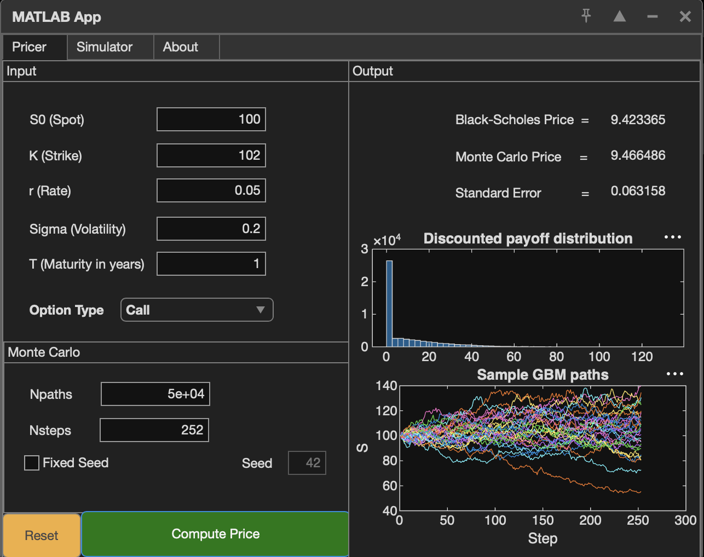
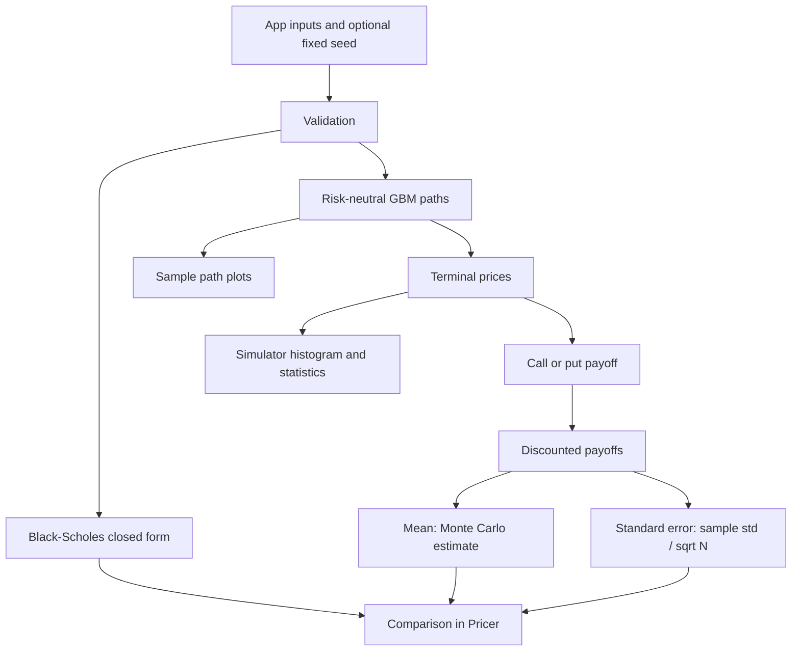

# MATLAB European Option Pricer: Black-Scholes vs Monte Carlo

[](https://github.com/diegomadriz/matlab-option-pricer/actions/workflows/ci.yml)
[](LICENSE)

An interactive MATLAB App Designer tool that prices European calls and puts two ways: with the
Black-Scholes closed form, and with a Monte Carlo simulation of geometric Brownian motion (GBM).
It shows how close the simulated estimate lands, with its standard error, and lets you explore
the simulated price paths.



## Example result

Call option with spot 100, strike 102, rate 5%, volatility 20%, 1 year, 50,000 paths and 252
time steps (MATLAB R2026a):

| Run | Black-Scholes | Monte Carlo estimate | Standard error | Gap in standard errors |
| --- | ---: | ---: | ---: | ---: |
| Fixed seed 42 | 9.423365 | 9.414263 | 0.062853 | 0.14 |
| Unseeded (shown above) | 9.423365 | 9.466486 | 0.063158 | 0.68 |

The Monte Carlo value is an estimate. It converges to the Black-Scholes value as the number of
paths grows, and its standard error shrinks like 1/√N. The seed-42 row is reproduced by CI on every push.

## Features

- **Pricer tab:** analytical price, Monte Carlo estimate and standard error side by side, the
  discounted-payoff distribution, and a sample of the simulated paths.
- **Simulator tab:** simulates GBM paths and shows the terminal-price distribution with its mean
  and standard deviation.
- **Reproducible runs:** an optional fixed seed (Mersenne Twister) makes every estimate repeatable.
- **Input validation** in the interface and in each numerical function, including the
  deterministic limit at zero maturity or zero volatility.

## How it works



- **Numerical core** (`pricing/`): three plain MATLAB functions, which the app and the tests both call.
  - `black_scholes_price` uses the closed form, with a deterministic branch when maturity or
    volatility is zero.
  - `simulate_gbm_paths` uses the exact exponential GBM update,
    `S(t+dt) = S(t)·exp((r − σ²/2)dt + σ√dt·Z)`, so there's no discretization bias at any step count.
  - `mc_euro_price` discounts the terminal payoffs and returns their mean and standard error.
- **Interface** (`app/Final_work.mlapp`): App Designer callbacks only collect inputs, set the seed,
  call the numerical core and plot. No pricing logic lives in the UI, which keeps it testable.
- **Validation:** each function checks for finite real scalar inputs, positive spot and strike,
  non-negative volatility and maturity, and integer step and path counts.

## Testing and CI

GitHub Actions runs on every push with MATLAB R2026a:

- **Static checks:** MATLAB Code Analyzer, plus MISS_HIT lint and style.
- **13 `matlab.unittest` tests:**
  - put-call parity, both analytical and on the same Monte Carlo draws
  - the zero-maturity and zero-volatility limits
  - payoff and standard-error formulas
  - Monte Carlo convergence to Black-Scholes within 5 standard errors
  - invalid-input rejection
  - exact agreement with the original implementation, kept as test fixtures
- **`reproduce_example`:** recomputes the seed-42 row above with the same call sequence as the
  app's Compute Price button, and checks it.

## Quickstart

Requires MATLAB with the Statistics and Machine Learning Toolbox (`normcdf`).

```bash
git clone https://github.com/diegomadriz/matlab-option-pricer.git
cd matlab-option-pricer
matlab -batch "addpath('tools'); check_matlab; results = runtests('tests'); assertSuccess(results)"
matlab -batch "reproduce_example"
```

Open `app/Final_work.mlapp` in App Designer to use the interface, or run
`demo/demo_option_pricing.m` for a script-only walkthrough. The lint tools are Python:
`pip install -r dev-requirements.txt`, then `mh_lint` and `mh_style`.

## Project layout

```text
app/                 App Designer interface
pricing/             Numerical core: Black-Scholes, GBM paths, Monte Carlo estimator
demo/                Script-only walkthrough
reproduce_example.m  Recomputes the seed-42 example
tests/               Unit, fidelity and end-to-end tests (fixtures/ holds the original implementation)
tools/               Code Analyzer gate used by CI
docs/images/         Screenshot
Report/              Technical report (PDF)
evidence/            Recorded runs, configuration and project history
```

## Limitations

- European calls and puts only, under constant-parameter, risk-neutral GBM. No early exercise,
  path-dependent payoffs, calibration to market data, or stochastic volatility.
- Full path matrices are kept in memory, so very large path counts are memory-bound.
- Prices are simulated and for illustration; this isn't financial advice.

## Links

- [Portfolio project page](https://www.diegoramirezmadriz.dev/projects/matlab-european-option-pricer)
- [Technical report (PDF)](Report/MATLAB_Option_Pricer_DiegoRamirez.pdf)
- [Recorded runs and project history](evidence/RESULTS.md)

MIT licensed.
