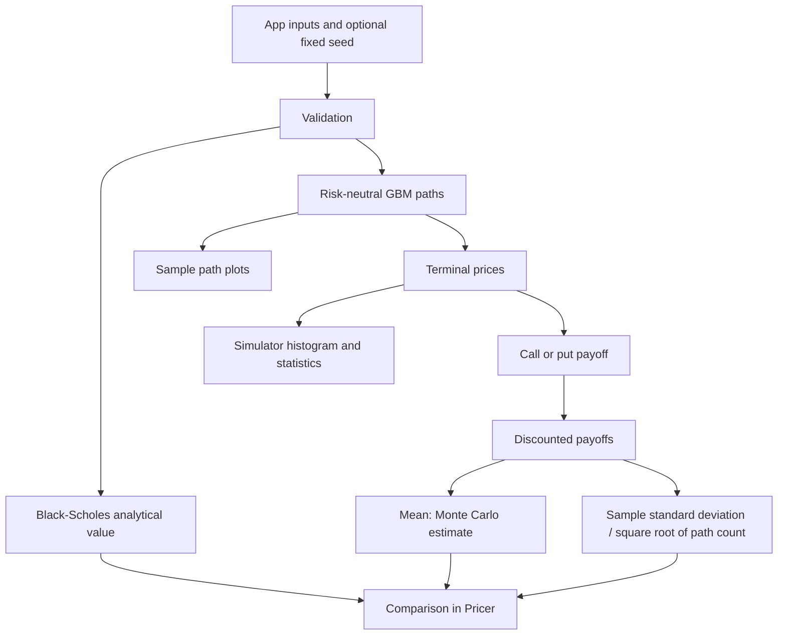

# MATLAB European Option Pricer: Black-Scholes vs Monte Carlo

An App Designer app with Pricer and Simulator tabs, built as December 2025 coursework, with the later fixes and publication changes listed below.


*Unseeded 2026 run recorded by the author in MATLAB Online R2026a Update 5 on October 3, 2026. The Monte Carlo value is an estimate.*

## Example run (MATLAB R2026a, 2026)

| Run | Black-Scholes value | Monte Carlo estimate | Standard error | Absolute gap / standard error |
| --- | ---: | ---: | ---: | ---: |
| Fixed seed 42 | 9.423365 | 9.414263 | 0.062853 | 0.14 |
| Unseeded | 9.423365 | 9.466486 | 0.063158 | 0.68 |

Both examples use spot 100, strike 102, annual rate 0.05, annual volatility 0.2,
maturity 1 year, 50,000 synthetic paths and 252 time steps. The app displays at most
30 paths. The gaps use the recorded six-decimal labels. Full recording provenance
and inputs are in [`example-runs-2026.json`](evidence/example-runs-2026.json).
These are post-course examples, not December measurements or a convergence benchmark.

[](https://github.com/diegomadriz/matlab-option-pricer/actions/workflows/ci.yml)
[](LICENSE)

**Verification:** CI runs Code Analyzer and all 13 tests on every push (badge above),
including fidelity against the December source and the recorded seed-42 example.
Before publication, the earlier 11-test suite also passed in MATLAB Online R2026a
Update 5 (Linux) on October 3, 2026.

## How it works



Numerical functions own the formulas; App Designer callbacks coordinate inputs,
optional Twister seeds and plots. The estimator uses the last row of the full path
matrix and returns a payoff mean and its standard error. Simulator explores the
underlying process. All price paths are synthetic, not market observations.
The app label “Monte Carlo Price” refers to an estimate.

## Full recorded results and configuration

| Workflow | Recorded result | Provenance |
| --- | --- | --- |
| Pricer, fixed seed | Values in the example table | Diego's October app run |
| Pricer, unseeded | Values in the example table and hero image | Diego's October app run; not repeatable without saved RNG state |
| Simulator, seed 42 | Terminal mean 105.082718; sample standard deviation 20.771853 | October run, 1,000 paths and 252 steps, matching model assumptions |
| December report | GBM path and terminal-price plots | Saved images only; historical raw samples, figure seed and pricing table absent |

| Parameter | App Pricer defaults | Standalone course demo |
| --- | ---: | ---: |
| Spot | 100 | 100 |
| Strike | 102 | 100 |
| Annual risk-free rate | 0.05 | 0.05 |
| Annual volatility | 0.2 | 0.2 |
| Maturity in years | 1 | 1 |
| Time steps | 252 | 252 |
| Pricing paths | 50,000 | 5,000 |
| Paths displayed | At most 30 | 20 |

Sources: [`results.json`](evidence/results.json), the re-saved app's MATLAB code and
[`demo/demo_option_pricing.m`](demo/demo_option_pricing.m). The older app preview
predated the final course defaults; it does not establish a conflicting strike.
The publication app is Diego's October re-save.

## Quickstart

MATLAB with Statistics and Machine Learning Toolbox is required for pricing
(`normcdf`). The published app is saved in R2026a; CI uses R2026a. The archive
restoration command needs base MATLAB only. Python supplies development lint
tooling; the pricing implementation remains MATLAB.

After the repository is published:

```bash
git clone https://github.com/diegomadriz/matlab-option-pricer.git
cd matlab-option-pricer
python -m pip install -r dev-requirements.txt
mh_lint --input-encoding utf-8 pricing demo tests tools restore_archive.m reproduce_example.m
mh_style --input-encoding utf-8 pricing demo tests tools restore_archive.m reproduce_example.m
matlab -batch "addpath('tools'); check_matlab; results = runtests('tests'); assertSuccess(results)"
matlab -batch "reproduce_example; restore_archive"
```

`reproduce_example` initializes Twister with seed 42, calls Black-Scholes, then
calls Monte Carlo exactly as the Pricer callback does before plotting. It prints
the analytical value, estimate and standard error, and checks the analytical
value to 1e-6. A test checks the recorded Monte Carlo estimate and standard error
to the same tolerance. This example uses the real synthetic calculation.
`restore_archive` copies the December report figures and evidence index and exports the saved
app configuration to gitignored `artifacts/`; it does not rerun those old draws.

The convergence diagnostic uses seed 1, 12 steps and 50,000 paths, with error at
most 5 standard errors plus a 1e-12 roundoff allowance. It also checks that the
estimated standard error decreases from a 1,000-path run. These are verification
settings, not measured convergence-rate claims. Tests include analytical and
same-seed Monte Carlo put-call parity, invalid inputs, and exact December-code
fidelity for positive maturity and volatility.

For the standalone course demo's parameters and fresh random draws:

```bash
matlab -batch "run('demo/demo_option_pricing.m')"
```

Open `app/Final_work.mlapp` in App Designer for the interface. CI runs lint,
formatting, MATLAB Code Analyzer, the tests, the recorded example and archive
restoration. No notebooks are present.

## Coursework and later changes

The coursework of record is the **December 30, 2025 course submission**, not the
later working folder. The numerical fixtures are its unchanged
December files; [`submission-manifest.json`](evidence/submission-manifest.json)
records that archive and its publishable contents.

- **July 9, 2026:** added the deterministic discounted-payoff branch for zero maturity or volatility in Black-Scholes.
- **October 3, 2026:** Diego corrected the Pricer fixed-seed reference from the nonexistent `SeedField` to `SeedEditField` in App Designer and re-saved the internally consistent R2026a app. The hand-edited July app is excluded.
- **October 3, 2026 publication edits:** added standalone scalar input checks, portable demo path setup and estimate wording, tests, reproduction, packaging, evidence and CI. Edited MATLAB files carry publication comments. These standalone guards are later additions; the coursework had GUI input checks.

See [`history.json`](evidence/history.json) and [`RESULTS.md`](evidence/RESULTS.md).

## Repo layout

```text
pricing/               Numerical routines; standalone guards added for publication
app/                   October App Designer re-save with fixed-seed correction
demo/                  Course demo adapted for path setup and wording
reproduce_example.m    Compute the recorded post-course seed-42 example
restore_archive.m      Restore December report evidence without simulation
docs/images/           Unedited unseeded Pricer screenshot
evidence/              Dated results, history, configurations and provenance hashes
Report/                Unchanged December course report
tests/                 Numerical, December-source fidelity and end-to-end tests
tests/fixtures/        Unchanged December numerical files
tools/                 MATLAB Code Analyzer gate
```

## Limitations

European calls and puts only, with constant inputs and risk-neutral GBM. Early
exercise, path-dependent payoffs, calibration, transaction costs and changing
volatility are outside the model. Estimates vary between random draws. Full path
matrices use memory; the synthetic examples are not market-validation evidence.
The December project has no reproducible accuracy, convergence-rate or runtime
benchmark. Its original random figure data cannot be recovered from saved images.
The current functions deliberately accept finite real scalar model inputs;
Monte Carlo standard error requires at least two paths. The changed test suite,
Code Analyzer, reproduction and GitHub CI need rerunning after these edits.
Outputs are educational, not financial advice.

## About and role

Diego Ramirez Madriz built the App Designer interface and orchestration callbacks,
Black-Scholes, Monte Carlo and GBM routines, GUI input checks, plots and standalone
demo for the December coursework. Later fixes and publication additions are dated
above. MIT covers the whole repository, including the report.

[Portfolio project page](https://www.diegoramirezmadriz.dev/projects/matlab-european-option-pricer)
 · [December course report](Report/MATLAB_Option_Pricer_DiegoRamirez.pdf)
 · [Results and history](evidence/RESULTS.md)
